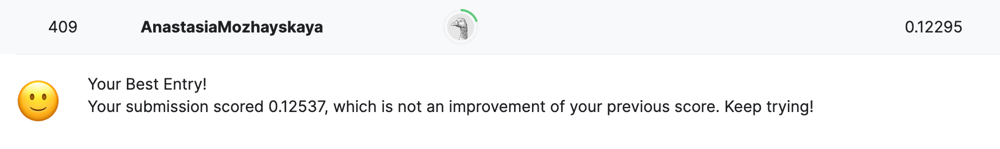

# House_Prices_Team_project-1
## Команда: Руслан, Тигран, Анастасия

**Проект:** предсказание цен на недвижимость

https://www.kaggle.com/competitions/house-prices-advanced-regression-techniques

Для предсказания были испытаны несколько моделей регрессии: Lasso, Catboost, Lightgbm, RandomForest

* 1  Исследование данных
* 2  Предобработка данных
*  2.1  Разделение обущающей выборки на таргет и фичи.
*  2.2  Объединения train и test для предобработки
*  2.3  Проверка на явные дубликаты
*  2.4  Анализ признаков и обработка пропусков
* 3  Формирование новых признаков
* 4  Анализ на мультиколлинеарность. Удаляем не информативные для машинного обучения признаки* 
*  4.1  Матрица корреляции
*  4.2  Lasso, как способ отбора признаков
*  4.3  Permutation importance
*  4.4  Анализ признаков деревянных моделей Shap values
* 5  Разделение обущающей выборки на трейн и тест
* 6  Работа с аномалиями
*  6.1  LotFrontage
*  6.2  BsmtFinSF1
*  6.3  GarageYrBlt
* 7  Кодирование и Масштабирование
* 8  Обучение моделей
*  8.1  Ridge
*  8.2  CatBoostRegressor
*  8.3  RandomForestRegressor
*  8.4  LGBMRegressor
* 9  Выбор и тестирование модели
* 10  Анализ важности признаков лучшей модели CatBoost
* 11 Итоговые выводы

### Итог: проверка точности - загрузка результата на kaggle 

- модель CatBoost показала лучший результат RMSE на тестовой выборке - 0.12295

- 409 место в лидерборде на 11.11.2023

